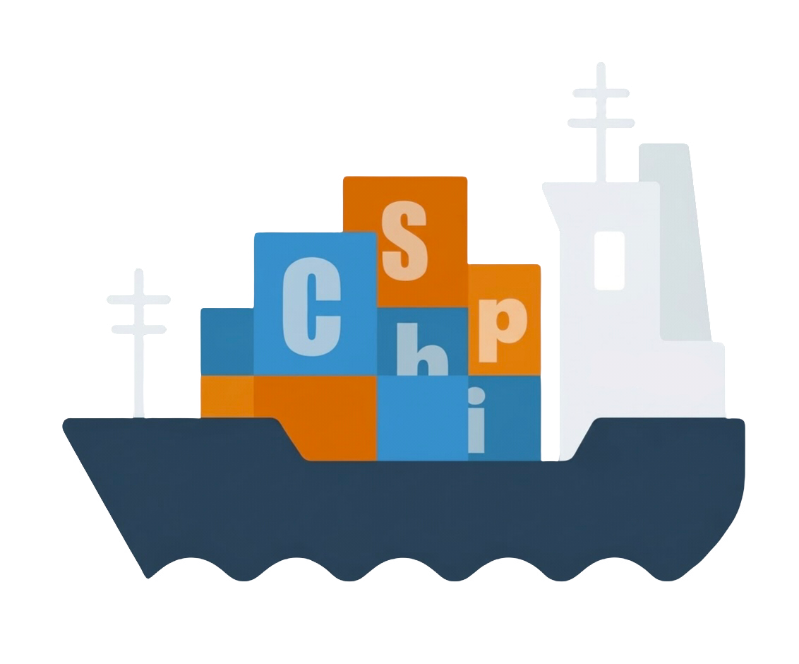

<div align="center">
  
  <h1>Cship</h1>
  <p><b>免安装的 Windows 桌面收纳工具</b></p>
  <p>一块悬浮在桌面上的玻璃方板，单击展开，把凌乱的桌面收进一块会呼吸的板子里。</p>
  <p>
    
    
    
    
  </p>
</div>

---

## 这是什么

Cship 是一个**免安装、零依赖**的 Windows 桌面收纳工具。双击一个 exe，桌面边缘就会出现一块三层错开叠加的半透明圆角方板；单击它，方板会"拉开消散"，从悬浮窗的位置向外扩大出一块收纳板——里面陈列着你桌面上的全部文件（图标 + 名称），可以拖动、重命名、删除、分类，也可以像窗口一样拉伸长宽。

它常驻后台，只占用任务栏隐藏图标区的一格；关掉窗口它也不走，除非你在托盘菜单里让它离开。

**没有安装程序，没有注册表写入（除可选的开机自启项），没有后台服务，没有联网。** 整个程序就是一个文件夹，复制到哪里都能跑，删掉文件夹就等于卸载干净。

## 特性

### 悬浮窗

- 三层半透明圆角方板错开叠加，光标悬停时错开间距与前后距离**丝滑拉大**
- 单击后三层板间距瞬间拉开、透明度推到 100% 完全消散，同时从悬浮窗位置向外扩大出收纳板
- 可左键拖动到屏幕任意位置（不会移出屏幕、不会压到任务栏），首次运行停在屏幕上方居中
- 材质、三层颜色、三层自定义图片均可换；支持预设与自定义两种模式
- 可锁定，锁定后无法拖动

### 收纳板

- 陈列桌面的全部文件、文件夹与软件，显示真实系统图标与名称
- 三层结构：上层图标区、中层背景板、下层自定义图片；中下层圆角，可拉伸长宽（有最小/最大限制），不可移动
- 右上角常驻三个控件：**垃圾桶**（拖动图标到其上松手即删除，走系统回收站）、**设置齿轮**、**关闭红点**
- 空白处右键：排序方式 / 刷新 / 新建；图标上右键：打开 / 打开文件所在位置 / 固定到开始屏幕 / 复制 / 重命名 / 属性
- 两套右键菜单都跟随全局界面颜色与收纳板材质
- `Esc` 收起收纳板
- 图标样式、大小、行距列距、不透明度、文件名显示、悬停显示文件名等均可调

### 分类页

- 收纳板顶部横向分类按钮行，按钮宽度随名称自适应
- 默认分类：全部 / 软件 / 文件夹 / 文件；右键可移除或重命名
- 分类项超出显示范围时自动折叠为「更多」，向下展开下拉
- 把图标拖到分类按钮上即加入该分类（复制语义，原图标不动）
- 分类视图与主收纳板共用同一套网格、菜单、悬停、指示灯与拖删逻辑

### 设置

仿 macOS 的两栏界面（左侧项、右侧子项），共五组：

| 分组 | 内容 |
|---|---|
| 全局设置 | 界面颜色（亮/暗/透明/自动/跟随系统，带预览图与切换过渡）、开机自启动、刷新率（60/90/120/165）、语言（简体中文/English）、字体预设、隐藏桌面图标 |
| 显示 | 悬浮窗大小、图标样式（原图标 / 隐藏后悬停渐显）、图标不透明度、文件名显示与悬停显示、图标大小、行距、列距、目标屏幕选择 |
| 高级 | 弹出方向、显示软件/文件/文件夹、禁用分类页及子开关、图标白色圆角遮罩、锁定图标拖动、双击打开开关、弹跳打开动画、运行指示灯、悬浮窗锁定、悬浮窗优先级、配置导出/导入 |
| 个性化 | 收纳板弹出动画、收纳板材质（含自定义背景图与显示范围框选）、悬浮窗自定义（预设/自定义，三层颜色或三层图片） |
| 关于 | 产品信息 |

### 系统集成

- **开机自启动**：写入 `HKCU\...\Run`，值为发布 exe 的绝对路径 + `--autostart`（静默启动，只出托盘与悬浮窗，不弹收纳板）
- **隐藏桌面图标**：隐藏后系统桌面图标不可见、不可选中、不可打开，但**不会删除**；程序崩溃或被强杀后重启会自动恢复，资源管理器重启也会自动重放隐藏意图
- **多屏**：自动跟随光标所在屏，也可指定屏幕（列出分辨率与显示器型号）
- **托盘菜单**：偏好设置 / 复位 / 关闭 / 重启，自绘并跟随主题与材质
- **单实例**：重复启动不会产生第二个托盘图标，而是让已有实例呼吸高亮
- 全屏游戏或视频前台时，置顶中的收纳板与设置窗会自动退让，退出全屏后恢复

## 快速开始

发行版分**两档**，按需选择：

### 完整版（离线即用）

纯净系统（无任何 .NET 环境）**双击即用、完全离线**，单架构约 60~64 MB。

```
Releases\完整版\                 ← 复制到哪里都能跑，也可以整个改名
├─ Cship.exe                     ← 64 位主程序（单文件，.NET 8 运行时整体打包）
├─ Cship-x86.exe                 ← 32 位主程序（与 64 位共用同一份配置）
└─ dependencies\
   └─ resources\                 ← 界面文案（中/英）与内置图标，外置可编辑
   （config\ 首次运行自动生成：settings/state/assets/iconcache/logs）
```

> WPF 不支持运行时裁剪（`PublishTrimmed` 会让程序崩溃），.NET 8 运行时是不可分割的整体——
> 压缩后的 63 MB 就是"离线即用"的正路下限。运行时整体打包且开启了单文件压缩：
> **首次启动需自解压（约慢半秒），常驻内存比精简版高约 120 MB**——在意内存请用精简版。

### 精简版（首次联网获取运行时，之后完全离线）

初始体积 **约 4 MB**。双击引导器，会弹窗从多个官方源下载 .NET 8 桌面运行时（约 68 MB，
进度条可见、可随时更换下载源），解压到**程序目录内**——不安装到系统、不写注册表、
不需要管理员权限。之后每次启动直接进主程序，**完全离线**。

```
Releases\精简版\
├─ Cship.exe / Cship-x86.exe           ← 引导器（双击这个；按文件名区分架构）
├─ Cship.app.exe / Cship.app-x86.exe   ← 主程序（不必直接双击它）
└─ dependencies\
   ├─ resources\                       ← 界面文案与内置图标
   ├─ runtime\{x64|x86}\dotnet\        ← 引导器首次运行时下载生成
   └─ config\                          ← 主程序首启生成（与完整版结构一致）
```

两个 exe 读的是**同一份 `config`**：换架构运行不会丢设置，也不会丢图标顺序（两档通用）。

> **该选哪一档？** 有网且在意磁盘 → 精简版；无网/受限环境或想开箱即用 → 完整版。
> **该选哪个架构？** 绝大多数情况选 `Cship.exe`（64 位），仅在 32 位系统上用 `Cship-x86.exe`。

## 从源码构建

需要 **.NET SDK 8.0**（LTS）。仓库根目录下：

```powershell
# 1) 生成程序图标（可选，产物已入库；改了 assets\CShip.png 后重跑）
powershell -NoProfile -ExecutionPolicy Bypass -File build\makeicon.ps1

# 2) 双档发布：完整版（self-contained）+ 精简版（framework-dependent + 引导器）
powershell -NoProfile -ExecutionPolicy Bypass -File build\build.ps1

# 开发期直接跑
dotnet run --project src\Cship
```

`build.ps1` 会先清空目标目录再产出，保证结果可复现。可选参数：

| 参数 | 作用 |
|---|---|
| `-Mode full` / `-Mode lite` | 只构建一档（默认两档全出） |
| `-NoCompress` | 完整版关闭单文件压缩（内存与启动更快，体积 +120MB） |
| `-Only x64` / `-Only x86` | 只打一个架构（调试用） |
| `-KeepTemp` | 保留中间暂存目录 |

精简版由三部分组成：**引导器**（`src\CshipBootstrapper`，net48 WinForms——目标机器没有 .NET 8 也能跑）、
**主程序**（framework-dependent 单文件）、**运行时下载器逻辑**（内置 3 个官方源，运行时优先在线查询
8.0 线最新版本号，失败退回内置版本）。构建与测试脚本的详细说明见 [`build/README.md`](build/README.md)。

## 数据与配置

- 所有可写数据都在 `<程序目录>\dependencies\config\`，**不写系统区、不写 AppData**。
- `config\` 里除了你自己的设置，其余内容（`iconcache\`、`logs\`、`assets\` 中的孤儿副本）都是**可再生的**，可以随时删除，程序下次启动会重建。
- 想备份设置，直接复制 `config\settings.json`；也可以用「高级 → 配置导出/导入」导出为 txt。

## 卸载

1. 托盘右键 → 关闭（或结束进程）。
2. 删除整个程序文件夹（`Releases\` 或你改过的名字）。
3. 如果开过开机自启，删掉注册表值 `HKEY_CURRENT_USER\Software\Microsoft\Windows\CurrentVersion\Run` 下的 `Cship`（也可以先在设置里关掉自启动开关）。

没有其他残留。

## 已知限制

- **精简版首次运行需要联网**：引导器内置 3 个官方下载源自动轮询、可手动换源，全部不可达时会提示改用完整版；
  运行时下载后存放在程序目录内，此后完全离线。
- **完整版的启动与内存**：完整版默认开启单文件压缩（体积减半），代价是首次启动需自解压（约慢半秒）、
  常驻内存比精简版高约 120 MB——在意内存与启动速度请用精简版。
- **材质**：Win10 上系统级亚克力/模糊对分层窗口不可用，程序采用**系统合成器模糊通道**实现玻璃观感；Win11 上同一通道由系统原生增强。个别系统版本或显卡驱动下可能回退为纯色板，观感会变，但不会黑底、不会崩。
- **动画帧率**：WPF 动画受垂直同步与渲染线程限制，高刷屏上的实际帧率可能达不到设置的刷新率档位。
- **32 位版内存**：`Cship-x86.exe` 受 32 位地址空间限制（约 2~4 GB），超大桌面（数百项）下更容易吃紧。
- **超大桌面**：常驻内存随桌面项数近似线性增长；500+ 项时开板内存可能超过 250 MB（正常规模桌面远低于此）。
- **混合 DPI 多屏**：已按逐屏 DPI 换算实现，但开发机为单显示器，跨屏拖动未经物理验证。

## 技术栈

- **C# 12 / .NET 8 (LTS) / WPF**（`net8.0-windows`），WinForms 仅用于托盘 `NotifyIcon` 与屏幕枚举
- **零第三方依赖**：全部功能只用 .NET 8 内置能力 + P/Invoke（`SystemBridge`）
- 设置/状态/导入导出：`System.Text.Json`
- 删除走系统回收站：`Microsoft.VisualBasic.FileIO`
- 发布：`dotnet publish --self-contained` 单文件，双架构 `win-x64` + `win-x86`
- 单实例：命名互斥体 + 消息激活

## 许可

[MIT](LICENSE)
